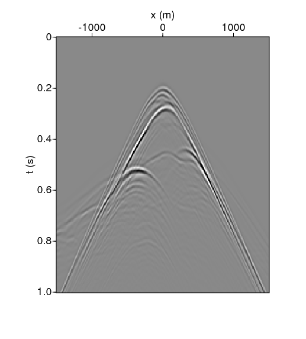
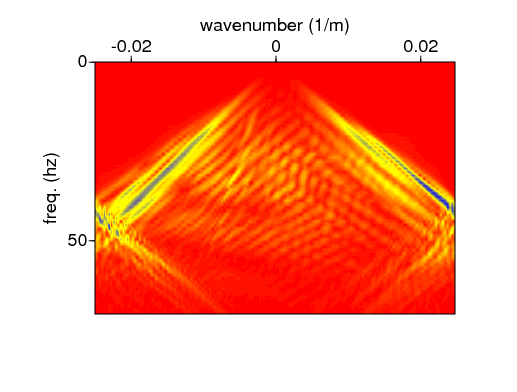
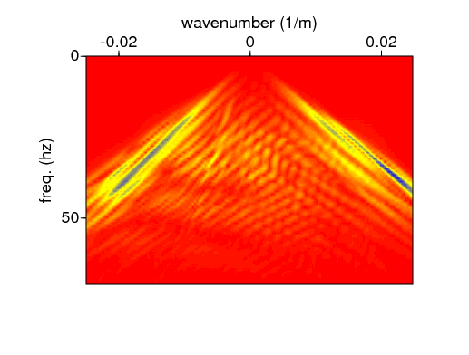
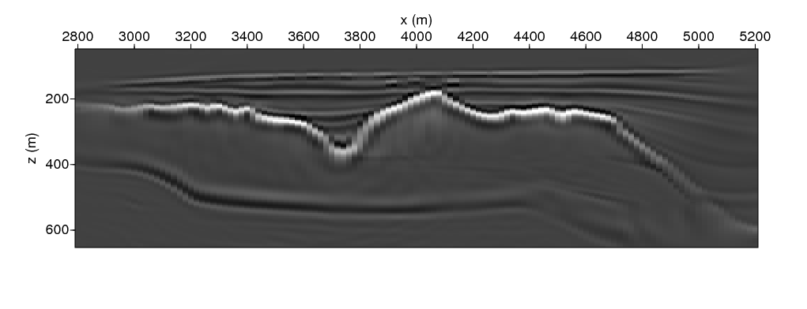
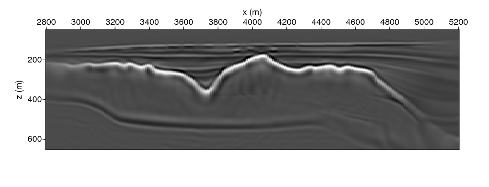

# Removing the spatial aliasing in seismic data using Deep Learning Super-Resolution
Aayush Garg, Delft University of Technology
Abe Vos, Nikita Bortych and Dr. Deepak Gupta, University of Amsterdam

## Abstract
> To do

## Blind Test
Input data with spatial aliasing |  Output data without spatial aliasing
:-------------------------:|:-------------------------:
  |  
  |  

### Influence of spatial aliasing in imaging

<strong> Imaging with spatially aliased data </strong>

 

<strong> Imaging with spatially aliased removed data </strong>

